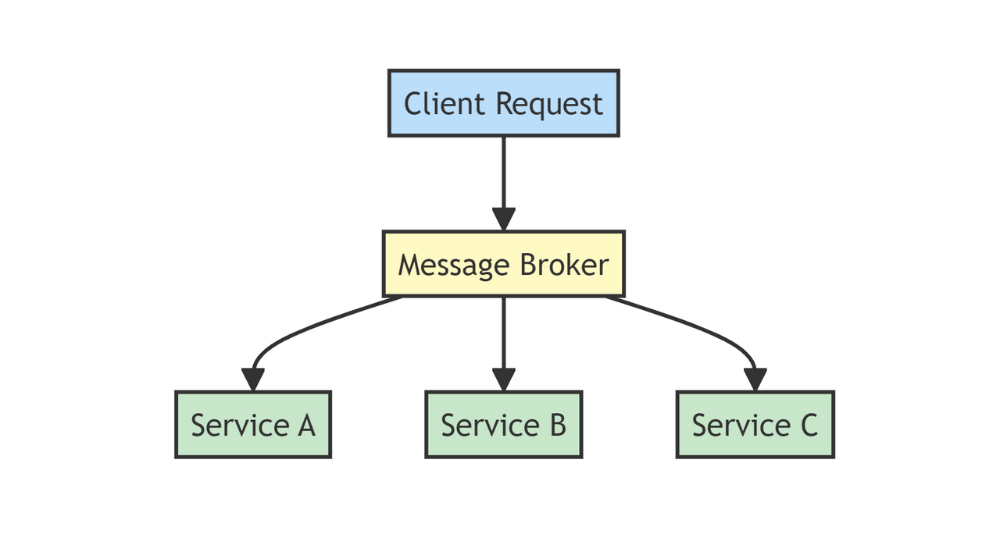
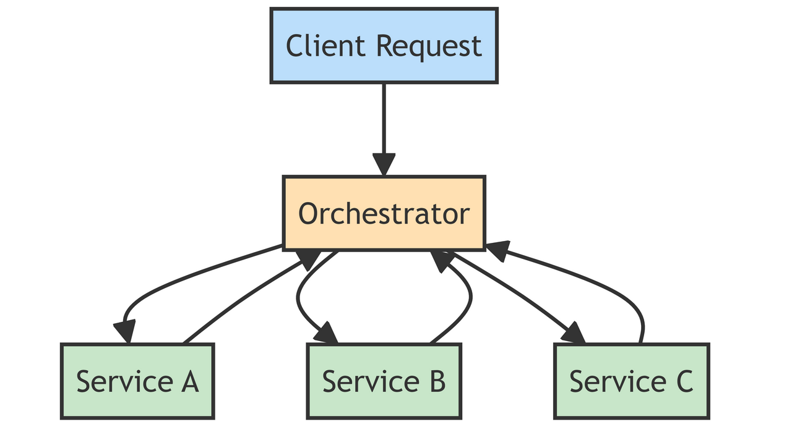

# Saga Design Pattern

In this article, I will discuss the Saga design pattern. First, we'll address some technical challenges of creating ACID transactions. Then, we'll explore the Saga design pattern and how to implement it.

## Database Per Service Pattern

First, let's talk about microservice architecture and the database per service pattern. Basically, each microservice in an application has its own dedicated database. This allows each microservice to manage its data independently, making it easier to develop, deploy, and scale each service without affecting the others. For instance, in an online store, the user service, order service, and inventory service each have their own databases. This isolation improves flexibility, as each service can choose the best database type for its needs and makes the system more resilient to failures.

However, there are some drawbacks to this pattern. Data consistency and distributed transactions are two of them. Since each microservice operates independently, it can lead to potential inconsistencies when updates occur across multiple services. Data duplication across the system can also lead to synchronization issues. Each transaction needs to be distributed across the system. If a failure occurs, rollbacks must happen across the system, leading to another problem: distributed transactions.

## What is the Saga Design Pattern?

The Saga design pattern is a method for managing long-running transactions in a microservice architecture by breaking down a complex transaction into a series of smaller, independent steps, each handled by a different service. If any step fails, compensating transactions are executed to undo the changes made by previous steps, ensuring data consistency across all services. This pattern can be implemented through choreography, where each service triggers the next step via events, or orchestration, where a central coordinator directs each step. First let’s talk about Choreography.

## What is Saga Choreography Pattern?

Let me share the meaning of Choreography first.

Choreography refers to the art of designing and arranging dance movements and sequences. It involves creating and planning the steps, patterns, and flow of a dance performance. Choreographers are responsible for envisioning the overall structure, style, and execution of the dance, ensuring it aligns with the music, theme, and intended emotions of the performance.

Basically, for Choreography, each choreographer is responsible for the execution of the dance. It is the same for microservice structure as well. Each service is responsible for the execution of its events. If there is a problem with the execution, each service is responsible for the rollback. There is no orchestration for these executions, so it is easier to manage. Let's create a flow for that and make sure we are on the same page.

[Saga Choreography Mermaid Flow](https://gist.github.com/ugurelveren/7a9327154653b91160fd3a80b200e957)

## Pros of Saga Choreography

- **Decentralization**: Each service is responsible for its own. So we don’t need to worry about dependent services. Reduces coupling between services, allowing for more independent development and deployment.
- **Scalability**: Since each service operates independently, it can be scaled individually based on its load and requirements, avoiding scalability bottlenecks.
- **Resilience**: Failures in one service can be managed and compensated locally without affecting the entire system. Improved fault isolation, as issues are contained within individual services.
- **Flexibility**: Easier to add or modify services without needing to change a central orchestrator. Allows for more flexible and dynamic workflows.
- **Autonomy**: Services can choose their own way to handle business logic and compensation actions. Encourages autonomous teams responsible for individual services.

## Cons of Saga Choreography

- **Complexity**: Since this is a distributed solution, it requires careful design, also increasing complexity in managing and understanding the entire workflow.
- **Coordination**: Harder to visualize and manage the flow of the overall business process since it is distributed. Debugging and tracing issues across multiple services can be challenging.
- **Consistency**: Maintaining eventual consistency can be tricky, especially in highly dynamic and interdependent workflows. Ensuring that all services eventually reach a consistent state requires robust compensating mechanisms.

There are also challenges at the performance level, as all async solutions come with natural latency. However, there are other techniques to solve this problem. Orchestration.

## Saga Orchestration Pattern

The Saga Orchestration Pattern manages long-running transactions in distributed systems by using a central orchestrator to ensure all operations either complete successfully or are rolled back through compensating actions.

There are three main steps for this:

1. **Orchestrator**: A central orchestrator (or coordinator) manages the entire process. It sends commands to various services to perform their tasks and waits for responses.
2. **Steps**: Each step in the process is a transaction performed by a service. If the step completes successfully, the orchestrator moves to the next step.
3. **Compensation**: If any step fails, the orchestrator triggers compensating transactions to undo the previous steps, ensuring data consistency.

Since there are some differences between Orchestration and Choreography. Orchestration centralizes control with a coordinator managing and sequencing the workflow steps, while choreography decentralizes control, allowing each service to independently react to and trigger events as part of the saga.

[Saga Orchestration Mermaid Flow](https://gist.github.com/ugurelveren/b3956b856970da9492c8bf1542914dee)

## Pros of Saga Orchestration

- **Centralized Control**: A central orchestrator manages the workflow, sending commands to and receiving responses from services.
- **Single Point of Coordination**: The orchestrator knows the sequence of steps and handles the execution and error handling.
- **Explicit Workflow**: The entire transaction flow is explicitly defined and controlled by the orchestrator.
- **Simplicity in Implementation**: Easier to implement as the orchestrator handles all the coordination.

## Cons of Saga Orchestration

- **Single Point of Failure**: The orchestrator can become a single point of failure, impacting the entire system if it goes down.
- **Complexity**: Adds complexity to the system architecture, especially in designing and maintaining the orchestrator.
- **Coupling**: Creates a degree of coupling between the orchestrator and the individual services, which can make changes more difficult.

## Which Saga Pattern Should We Use?

This is the question we need to answer based on the technical requirements and complexity of our solution.

### Saga Choreography Pattern

Use this pattern if:

- You want decentralization and to avoid a single point of failure.
- Transactions are relatively straightforward and services have well-defined boundaries.
- You want to build a system that can scale independently without a centralized bottleneck.

### Saga Orchestration Pattern

Use this pattern if:

- You have complex transactions involving intricate business logic.
- Steps need to be executed in a specific order.
- You need strong consistency and a central entity to ensure all steps are completed correctly.
